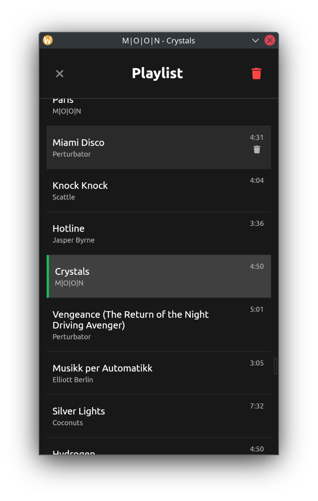

# webview-mpd-player

A lightweight MPD (Music Player Daemon) client built with Crystal and Webview. Features a web-based interface for controlling MPD playback, managing playlists, and displaying album artwork.

This application serves as a demonstration of building real-time applications using Crystal and Webview. It showcases how to create responsive desktop applications that can handle live updates and user interactions while maintaining a lightweight footprint. The integration with MPD provides a practical example of managing real-time events, state synchronization, and UI updates in a Crystal-based desktop application.


## Installation

1. Clone the repository:
   ```bash
   git clone git@github.com:mamantoha/webview-mpd-player.git
   cd webview-mpd-player
   ```

2. Install dependencies:
   - Crystal (>= 1.16.0)
   - MPD (Music Player Daemon)
   - pkg-config
   - WebKit2GTK development files

3. Build the application:
   ```bash
   shards install
   shards build

   ```

## Screenshots




## Contributing

1. Fork it (<https://github.com/mamantoha/webview-mpd-player/fork>)
2. Create your feature branch (`git checkout -b my-new-feature`)
3. Commit your changes (`git commit -am 'Add some feature'`)
4. Push to the branch (`git push origin my-new-feature`)
5. Create a new Pull Request

## Contributors

- [Anton Maminov](https://github.com/mamantoha) - creator and maintainer
